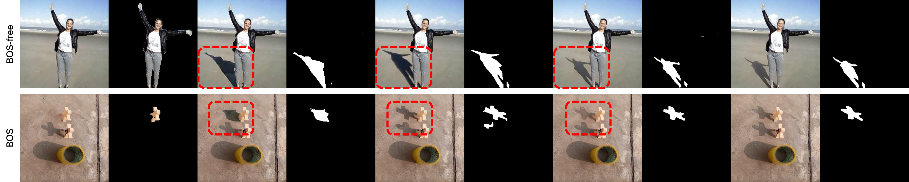
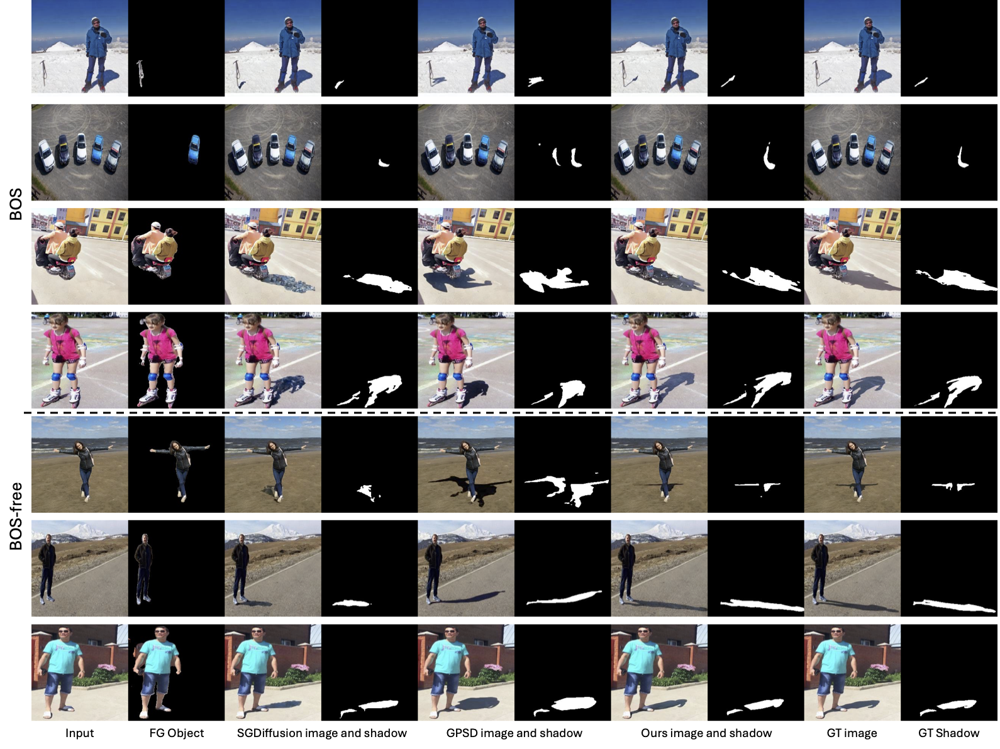
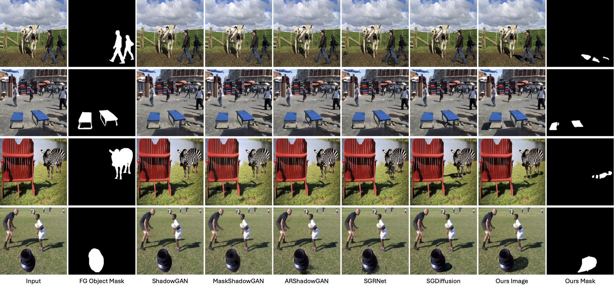

# ShadowGeneration

**Physics-Grounded Shadow Generation from Monocular 3D Geometry Priors and Approximate Light Direction**  
Shilin Hu, Jingyi Xu, Akshat Dave, Dimitris Samaras, Hieu Le  
arXiv, 2025. [[arXiv](https://arxiv.org/abs/2512.06174)]

This repository currently provides **qualitative results**.  
**Code and training/inference instructions will be released in a future update.**

---

## Overview




---

## Results

### Comparison with SOTA

<figure>
  
  <figcaption><em>Visual results in both BOS (with background reference object–shadow pairs) and BOS-free (single object–shadow pair). Our method produces higher image fidelity and more accurate shadow masks that better respect occluder–receiver–illumination relationships.</em> </figcaption>
</figure>

### Real Composite

<figure>
  
  <figcaption><em>Qualitative comparison on manual composite images where a foreground object is pasted into a new background. Our method generates shadows that are aligned with the inserted objects and consistent with the background illumination.</em> </figcaption>
</figure>

---

## Citation

If you find this work useful, please cite:

```bibtex
@misc{hu2025physicsgroundedshadowgenerationmonocular,
      title={Physics-Grounded Shadow Generation from Monocular 3D Geometry Priors and Approximate Light Direction}, 
      author={Shilin Hu and Jingyi Xu and Akshat Dave and Dimitris Samaras and Hieu Le},
      year={2025},
      eprint={2512.06174},
      archivePrefix={arXiv},
      primaryClass={cs.CV},
      url={https://arxiv.org/abs/2512.06174}, 
}
